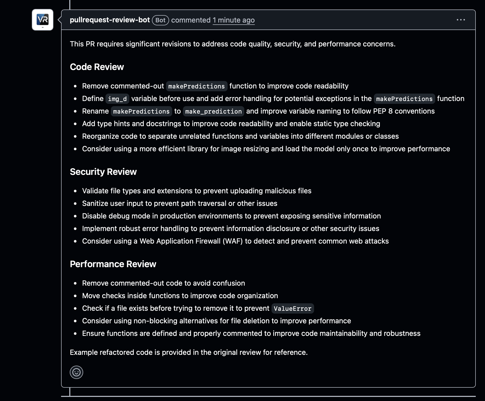

# PR Review Bot 🤖

> AI-powered GitHub App that automatically reviews every Pull Request for bugs, security vulnerabilities, and performance issues — free to install, zero configuration required.

[](https://github.com/apps/pullrequest-review-bot)
[](https://github.com/apps/pullrequest-review-bot)
[](https://pr-review-bot-production-af3b.up.railway.app)
[](https://python.org)
[](https://github.com/langchain-ai/langgraph)
[](LICENSE)
[]()

---

## Example review



---

## Install in 30 seconds

1. Click **[Install App](https://github.com/apps/pullrequest-review-bot)**
2. Choose your GitHub account or organisation
3. Select which repositories to grant access to
4. Open a Pull Request — the bot reviews it automatically

No configuration files. No API keys. No setup.

---

## What it does

When a Pull Request is opened or updated, three AI agents analyse the diff simultaneously and post a single clean review comment within 30 seconds.

**Automatic PR review**
- Code Quality Agent — logic errors, readability, best practices, dead code
- Security Agent — SQL injection, XSS, hardcoded secrets, insecure dependencies
- Performance Agent — N+1 queries, inefficient loops, memory leaks, blocking calls

**Interactive chat**

Mention `@pullrequest-review-bot[bot]` in any PR comment to ask follow-up questions. The bot has full context of the diff, all changed files, and the entire comment thread.

```
@pullrequest-review-bot[bot] why is line 23 a security risk?
@pullrequest-review-bot[bot] can you suggest a fix for the N+1 query?
@pullrequest-review-bot[bot] is this approach thread-safe?
@pullrequest-review-bot[bot] what does the validate_user function do?
```

**Learning memory**

Every review is stored in Supabase. Future reviews on the same repo use past findings as context — the bot learns your codebase's patterns over time.

---

## Example output

When you open a PR, the bot posts a comment like this:

> **🔍 Code Review Summary**
>
> This PR requires attention for security and performance issues.
>
> **Security 🔴**
> - `auth/login.py` line 23: SQL query built with string concatenation — vulnerable to SQL injection. Use parameterised queries.
> - Line 45: Hardcoded API key detected. Move to environment variables.
>
> **Performance 🟡**
> - `api/users.py` line 67: N+1 query inside loop. Fetch all users in a single query before the loop.
> - Line 102: 50+ line commented-out block should be removed.
>
> **Code Quality 🟢**
> - Overall structure is clean and follows best practices.
> - Consider extracting validation logic from `validate_user()` into smaller helper functions.

---

## Architecture

```
GitHub PR opened/updated
         │
         ▼
  GitHub App webhook ──► FastAPI on Railway
         │
         ├── HMAC signature verification
         ├── Rate limit check (10 reviews/hour per repo)
         ├── PR size check (skip if > 50KB)
         └── Background task (returns 200 immediately)
                   │
                   ▼
          LangGraph pipeline
          ┌──────────────────┐
          │     fan_out      │
          └──┬───────┬───────┘
             │       │       │
             ▼       ▼       ▼
           Code  Security  Performance
          Agent   Agent     Agent
             │       │       │
             └───────┴───────┘
                     │
                     ▼
              Summarizer agent
                     │
           ┌─────────┴──────────┐
           ▼                    ▼
   Post to GitHub PR       Store in Supabase
   as review comment       (memory for future reviews)
```

---

## Tech stack

| Layer | Technology | Purpose |
|-------|------------|---------|
| Server | FastAPI + Railway | Webhook receiver, always-on hosting |
| AI Framework | LangGraph | Multi-agent parallel orchestration |
| LLM | LLaMA 3.3 70B via Groq | Code analysis and chat |
| Embeddings | all-MiniLM-L6-v2 (HuggingFace) | Semantic memory search |
| GitHub | PyGitHub + GitHub App JWT | Auth, fetch diffs, post comments |
| Memory | Supabase Postgres + pgvector | Store past reviews per repo |
| Keep-alive | UptimeRobot | Ping /health every 5 minutes |

---

## Production safeguards

| Safeguard | Detail |
|-----------|--------|
| HMAC verification | Every webhook validated against shared secret before processing |
| Rate limiting | Max 10 reviews per repo per hour |
| Size guard | PRs larger than 50KB skipped with an explanatory comment |
| Async processing | Webhook returns 200 immediately; review runs in background |
| Timeout | Background tasks cancelled after 120 seconds |
| Bot loop prevention | Never responds to its own comments |

---

## Costs

| Service | Free Limit | Usage | Cost |
|---------|------------|-------|------|
| Groq | 14,400 req/day | ~4 req per PR | $0 |
| Railway | $5 credit/month | ~$0.50/month | $0 |
| Supabase | 500MB database | ~2KB per review | $0 |
| UptimeRobot | 50 monitors | 1 monitor | $0 |
| GitHub App | Free | Free | $0 |

**Total: $0/month for personal use or small teams.**

---

## Self-hosting

### Prerequisites
- Python 3.12+
- Groq API key (free at [console.groq.com](https://console.groq.com))
- Supabase account (free at [supabase.com](https://supabase.com))

### Setup

```bash
# Clone
git clone https://github.com/vi6120/pr-review-bot.git
cd pr-review-bot

# Install
python -m venv .venv
source .venv/bin/activate
pip install -r requirements.txt

# Configure
cp .env.example .env
# Fill in: GROQ_API_KEY, GITHUB_APP_ID, GITHUB_PRIVATE_KEY,
#          GITHUB_WEBHOOK_SECRET, SUPABASE_URL, SUPABASE_KEY

# Run
uvicorn webhook:app --reload --port 8000
```

### Environment variables

| Variable | Description |
|----------|-------------|
| `GITHUB_APP_ID` | Your GitHub App's numeric ID |
| `GITHUB_PRIVATE_KEY` | Full contents of the .pem private key |
| `GITHUB_WEBHOOK_SECRET` | Secret string from GitHub App settings |
| `GROQ_API_KEY` | From console.groq.com — free tier available |
| `SUPABASE_URL` | From Supabase project → Settings → API |
| `SUPABASE_KEY` | Supabase anon or service role key |

### Optional tuning

| Variable | Default | Description |
|----------|---------|-------------|
| `RATE_LIMIT_PER_HOUR` | 10 | Max reviews per repo per hour |
| `MAX_DIFF_SIZE` | 50000 | Skip PRs larger than this (chars) |
| `REVIEW_TIMEOUT` | 120 | Background task timeout (seconds) |
| `LLM_MODEL` | llama-3.3-70b-versatile | Groq model name |

---

## File structure

```
pr-review-bot/
├── webhook.py        ← FastAPI server, rate limiting, timeouts
├── agents.py         ← LangGraph 3-agent parallel pipeline
├── chat_agent.py     ← Multi-turn @mention chat with full context
├── github_client.py  ← Fetch diffs, file contents, post comments
├── github_app.py     ← JWT → installation token authentication
├── memory.py         ← Supabase pgvector read/write
├── llm.py            ← Groq LLM provider config
├── config.py         ← All environment variables in one place
├── setup_supabase.py ← Database initialisation script
├── screenshot.png    ← Example bot review comment
└── railway.json      ← Railway deployment config
```

---

## Contributing

Contributions welcome.

```bash
git checkout -b feature/your-feature
git commit -m 'Add your feature'
git push origin feature/your-feature
# Open a PR — the bot will review it automatically 🤖
```

**Ideas for contributions:**
- Review re-trigger command (`@bot re-review`)
- Sentry error tracking integration
- Per-repo configurable review rules
- Slack/Discord notifications
- Monorepo path filtering
- Line-level inline review comments

---

## Roadmap

- [ ] GitHub Marketplace listing
- [ ] Sentry error tracking
- [ ] Review re-trigger command
- [ ] Inline line-level comments
- [ ] Configurable rules per repo
- [ ] CI/CD pipeline integration
- [ ] Analytics dashboard

---

## License

MIT — free for personal, educational, and commercial use.

---

<p align="center">
  Built by <a href="https://github.com/vi6120">Vikas Ramaswamy</a> ·
  Powered by LangGraph · LLaMA 3.3 · FastAPI · Groq · Supabase
</p>

<p align="center">
  <a href="https://github.com/apps/pullrequest-review-bot">Install Now</a> ·
  <a href="https://github.com/vi6120/pr-review-bot/issues">Report Bug</a> ·
  <a href="https://github.com/vi6120/pr-review-bot/discussions">Discussions</a>
</p>
